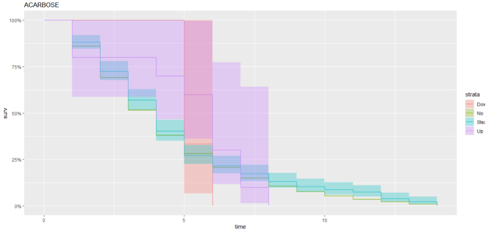

# Drug Treatment and Length of Stay at Hospital for Diabetic Patients

This project explores the impact of drug treatments on the length of hospital stays for diabetic patients. Using survival analysis and various machine learning techniques, this study aims to predict hospital stay durations based on drug treatment effectiveness.

# 1. Project Details:
Institution: Andhra University College of Engineering
Authors: Anuradha Sahithi Padavala, Velugula Bindusree, Bhavisetty Deva Harshini
Supervisor: Dr. A. Mary Sowjanya, Assistant Professor

# 2. Abstract

The project utilizes survival analysis to predict hospital stay lengths for diabetic patients treated with insulin and combinations of drugs. The aim is to identify effective treatment strategies that minimize hospital stay while maximizing patient recovery outcomes.

# 3. Installation

Requirements:
- R Software Environment
- RStudio

Install required R packages:

install.packages("survival")
install.packages("survminer")
install.packages("dplyr")

# 4. Usage
Load the project in RStudio and run the analysis scripts provided to see the effects of different drug treatments on patient outcomes.

# 5. Results

# 6. Conclusion
We check whether readmission is required or not and check the efficiency of survival analysis models and models combined with classification techniques like random forest method .The decision to obtain the process of survival analysis for patients with diabetes is a useful predictor of readmission rates which may prove valuable to reduce readmission rates and costs for the care of individuals with diabetes. The major diagnosis for patients is well known before readmission. The project can be much more efficient by using classification methods like Naive Bayes method or Kernel estimation.  

# 7. Acknowledgments
Andhra University College of Engineering for providing the resources and support.
Prof. Kuda Nageswara Rao for administrative support and guidance.
